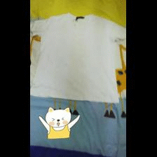

## Fashion Cut in the Wild (Clothes Cutout System)
[[Project]](https://liuziwei7.github.io/projects/DeepFashion.html) [[Paper]](http://www.cv-foundation.org/openaccess/content_cvpr_2016/papers/Liu_DeepFashion_Powering_Robust_CVPR_2016_paper.pdf)   



## Overview
`Clothes Cutout System` is a clothes cutout framework based on [dense CRF](http://graphics.stanford.edu/projects/densecrf/). Given a fashion image and its [fashion landmarks](https://liuziwei7.github.io/projects/FashionLandmarks.html), this software segments the potential clothing item in it. 

Further information please contact [Shen Tan](https://www.linkedin.com/in/shentan) and [Ziwei Liu](https://liuziwei7.github.io/).

## Requirements
* [dense CRF](http://www.philkr.net/papers/2011-12-01-nips/densecrf_v_2_2.zip)

## Getting started
* Install and compile the [dense CRF](http://www.philkr.net/papers/2011-12-01-nips/densecrf_v_2_2.zip).
* Run the demo script:
``` bash
matlab ./code/demo.m
```

## Dataset
[Large-scale Fashion (DeepFashion) Database](http://mmlab.ie.cuhk.edu.hk/projects/DeepFashion.html)

## License and Citation
The use of this software is RESTRICTED to **non-commercial research and educational purposes**.

```
@inproceedings{liu2016deepfashion,
 author = {Ziwei Liu, Ping Luo, Shi Qiu, Xiaogang Wang, and Xiaoou Tang},
 title = {DeepFashion: Powering Robust Clothes Recognition and Retrieval with Rich Annotations},
 booktitle = {Proceedings of IEEE Conference on Computer Vision and Pattern Recognition (CVPR)},
 month = {June},
 year = {2016} 
}
```
